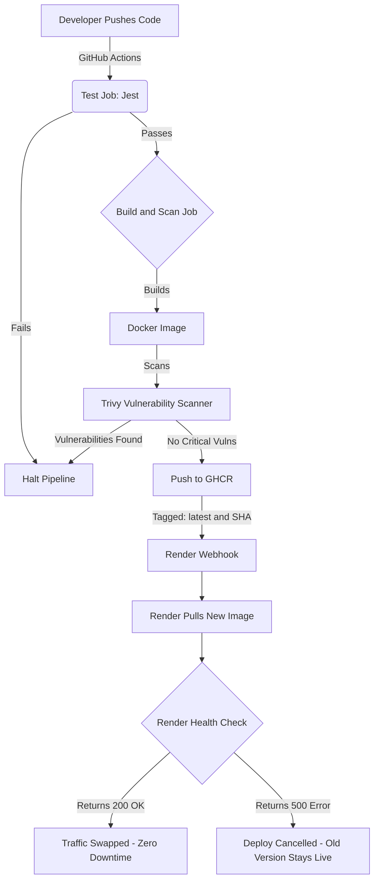
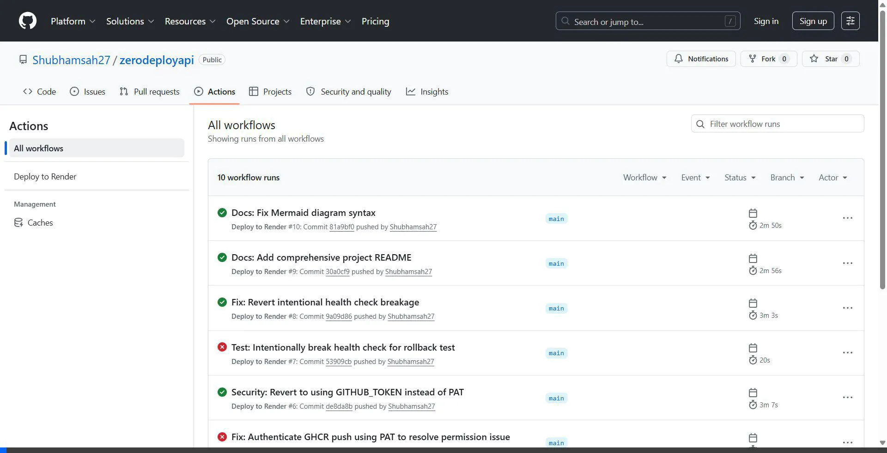

# ZeroDeploy API 🚀

[](https://github.com/Shubhamsah27/zerodeployapi/actions/workflows/deploy.yml)
[](https://pulseapi-zu03.onrender.com/)

A demonstration of a fully automated, production-grade CI/CD pipeline built around a Node.js API. Every push to `main` securely tests, builds, scans, and deploys the application with zero downtime.

**[🌐 View Live Dashboard](https://pulseapi-zu03.onrender.com/)** | **[🚦 View Health Check](https://pulseapi-zu03.onrender.com/health)**

---

## 🏗️ Architecture Flow

The pipeline is entirely automated using **GitHub Actions**. Here is what happens under the hood when a developer pushes code:



---

## 🎥 Pipeline Demonstration

Watch the automated pipeline successfully test, build, scan, and deploy:



---

## ✨ Features

- **Automated Testing:** Jest runs on every push. Bad code fails immediately.
- **Containerized:** Lightweight `node:20-alpine` Docker image.
- **Security Scanned:** Trivy checks the image for High/Critical vulnerabilities before it's allowed to deploy.
- **Immutable Artifacts:** Images are pushed to GHCR (`ghcr.io`) and tagged with their Git commit SHA for instant rollbacks.
- **Zero-Downtime Deployments:** Hosted on Render. Render health-checks the new container before serving live traffic to it.

---

## 💻 Running Locally

1. **Clone the repo:**
   ```bash
   git clone https://github.com/Shubhamsah27/zerodeployapi.git
   cd zerodeployapi
   ```

2. **Install dependencies:**
   ```bash
   npm install
   ```

3. **Run tests:**
   ```bash
   npm test
   ```

4. **Start the server:**
   ```bash
   npm start
   ```
   *The API will be available at `http://localhost:3000`.*

---

## 🛡️ Built With
- **Node.js / Express** - API Framework
- **Jest** - Unit Testing
- **Docker** - Containerization
- **Trivy** - Security Vulnerability Scanning
- **GitHub Actions** - CI/CD Pipeline
- **GitHub Container Registry** - Image Hosting
- **Render** - Cloud Hosting & Deployment
